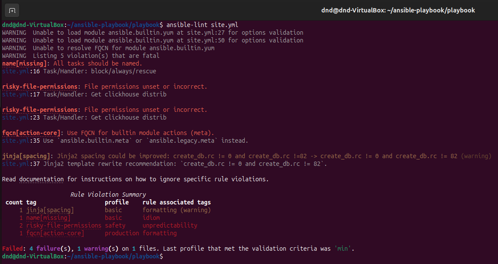
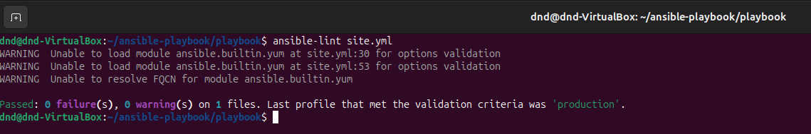
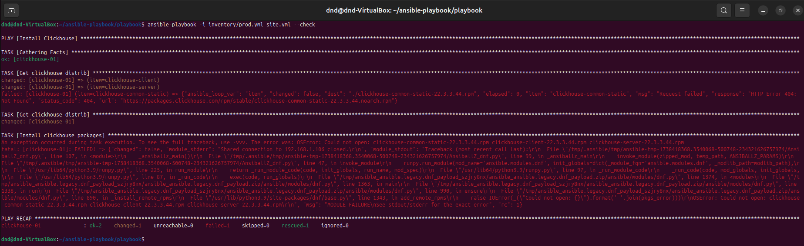
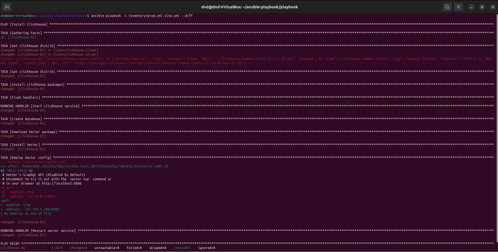
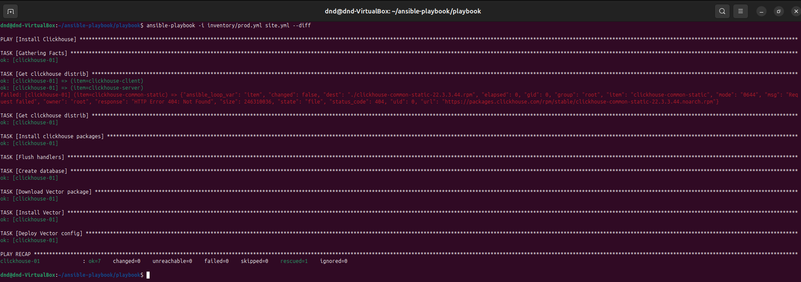

# Домашнее задание к занятию "`Работа с Playbook`" - `Дедюрин Денис`

---
## Задание.

1. Подготовьте свой inventory-файл `prod.yml`.
2. Допишите playbook: нужно сделать ещё один play, который устанавливает и настраивает [vector](https://vector.dev). Конфигурация vector должна деплоиться через template файл jinja2. От вас не требуется использовать все возможности шаблонизатора, просто вставьте стандартный конфиг в template файл. Информация по шаблонам по [ссылке](https://www.dmosk.ru/instruktions.php?object=ansible-nginx-install). не забудьте сделать handler на перезапуск vector в случае изменения конфигурации!
3. При создании tasks рекомендую использовать модули: `get_url`, `template`, `unarchive`, `file`.
4. Tasks должны: скачать дистрибутив нужной версии, выполнить распаковку в выбранную директорию, установить vector.
5. Запустите `ansible-lint site.yml` и исправьте ошибки, если они есть.
6. Попробуйте запустить playbook на этом окружении с флагом `--check`.
7. Запустите playbook на `prod.yml` окружении с флагом `--diff`. Убедитесь, что изменения на системе произведены.
8. Повторно запустите playbook с флагом `--diff` и убедитесь, что playbook идемпотентен.
9. Подготовьте README.md-файл по своему playbook. В нём должно быть описано: что делает playbook, какие у него есть параметры и теги. Пример качественной документации ansible playbook по [ссылке](https://github.com/opensearch-project/ansible-playbook). Так же приложите скриншоты выполнения заданий №5-8
10. Готовый playbook выложите в свой репозиторий, поставьте тег `08-ansible-02-playbook` на фиксирующий коммит, в ответ предоставьте ссылку на него.

### Ответ: 

1. Подготавливаем свой inventory-файл **prod.yml** приведя его к виду (добавив ip-адрес ВМ):

```
---
clickhouse:
  hosts:
    clickhouse-01:
      ansible_host: 192.168.1.106
```
2. Дописываем **playbook** который устанавливает и настраивает **vector**. Приводим **site**.yml к виду:

```
---
- name: Install Clickhouse
  hosts: clickhouse
  handlers:
    - name: Start clickhouse service
      become: true
      ansible.builtin.service:
        name: clickhouse-server
        state: restarted
    - name: Restart vector service
      become: true
      ansible.builtin.service:
        name: vector
        state: restarted
  tasks:
    - block:
        - name: Get clickhouse distrib
          ansible.builtin.get_url:
            url: "https://packages.clickhouse.com/rpm/stable/{{ item }}-{{ clickhouse_version }}.noarch.rpm"
            dest: "./{{ item }}-{{ clickhouse_version }}.rpm"
          with_items: "{{ clickhouse_packages }}"
      rescue:
        - name: Get clickhouse distrib
          ansible.builtin.get_url:
            url: "https://packages.clickhouse.com/rpm/stable/clickhouse-common-static-{{ clickhouse_version }}.x86_64.rpm"
            dest: "./clickhouse-common-static-{{ clickhouse_version }}.rpm"
    - name: Install clickhouse packages
      become: true
      ansible.builtin.yum:
        name:
          - clickhouse-common-static-{{ clickhouse_version }}.rpm
          - clickhouse-client-{{ clickhouse_version }}.rpm
          - clickhouse-server-{{ clickhouse_version }}.rpm
      notify: Start clickhouse service
    - name: Flush handlers
      meta: flush_handlers
    - name: Create database
      ansible.builtin.command: "clickhouse-client -q 'create database logs;'"
      register: create_db
      failed_when: create_db.rc != 0 and create_db.rc !=82
      changed_when: create_db.rc == 0

    - name: Install and configure Vector
      block:
        - name: Download Vector package
          ansible.builtin.get_url:
            url: "https://packages.timber.io/vector/{{ vector_version }}/vector-{{ vector_version }}-{{ vector_version_suffix }}.x86_64.rpm"
            dest: "./vector-{{ vector_version }}.rpm"
            mode: '0644'
        - name: Install Vector
          become: true
          ansible.builtin.yum:
            name: "./vector-{{ vector_version }}.rpm"
            state: present
            disable_gpg_check: true
        - name: Deploy Vector config
          become: true
          ansible.builtin.template:
            src: "templates/vector.yaml.j2"
            dest: "/etc/vector/vector.yaml"
            mode: '0644'
          notify: Restart vector service
```

При выполнении комнады **ansible-lint site.yml** получаем ошибки:



```
name[missing]: All tasks should be named.
site.yml:16 Task/Handler: block/always/rescue 
```
Ошибка говорит о том, что отстутсвует имя блока:

```
risky-file-permissions: File permissions unset or incorrect.
site.yml:17 Task/Handler: Get clickhouse distrib

risky-file-permissions: File permissions unset or incorrect.
site.yml:23 Task/Handler: Get clickhouse distrib
```
Ошибки говорят о том, что нехватает прав доступа к файлам. **mode: '0644'**

```
fqcn[action-core]: Use FQCN for builtin module actions (meta).
site.yml:35 Use `ansible.builtin.meta` or `ansible.legacy.meta` instead.
```
Ошибка говорит о том, что указан не полный идетификатор.

```
jinja[spacing]: Jinja2 spacing could be improved: create_db.rc != 0 and create_db.rc !=82 -> create_db.rc != 0 and create_db.rc != 82 (warning)
site.yml:37 Jinja2 template rewrite recommendation: `create_db.rc != 0 and create_db.rc != 82`.
```
Ошибка говорит о том, что не хвататет пробела перед "82".

Исправляем найденный ошибки и пробуем повторно запустить **ansible-lint site.yml**:



Пробуем выполнить команду:
```
ansible-playbook -i inventory/prod.yml site.yml --check
```


Плейбук упал с ошибкой, в которой говорится, что на текущий момент на удаленном хосте еще ничего не установлено.

Выполнняем команду: 

```
ansible-playbook -i inventory/prod.yml site.yml --diff
```
Видим, что произошли изменения в системе.



Повторно выполним предыдущую команду.



Видим, что новых изменений не произошло, а это говорит о том, что **playbook** идемпотентен.

Что выполняет сам **playbook**:

Этот плейбук устанавливает и настраивает два сервиса: **Clickhouse** и **Vector**.

## Описание

### 1. **Установка Clickhouse:**
- Скачивает и устанавливает необходимые RPM-пакеты для **Clickhouse**.
- Если скачивание основного пакета не удаётся, пытается скачать альтернативный.
- Устанавливает нужные пакеты с помощью `yum`.
- Создаёт базу данных `logs` с помощью команды `clickhouse-client`.

### 2. **Установка и настройка Vector:**
- Скачивает и устанавливает пакет **Vector**.
- Развёртывает конфигурацию Vector, копируя шаблон (`vector.yaml.j2`) в `/etc/vector/`.
- Перезапускает сервис Vector после установки и настройки.

## Параметры

- **clickhouse_version**: версия Clickhouse, используемая для скачивания и установки пакетов.
- **clickhouse_packages**: список пакетов Clickhouse для установки (например, `clickhouse-common-static`, `clickhouse-client`, и `clickhouse-server`).
- **vector_version**: версия Vector, используемая для скачивания пакета.
- **vector_version_suffix**: суффикс версии Vector (например, "stable").

## Теги

Плейбук не содержит явных тегов, но если их добавить, они могут быть, например, такими:
- `clickhouse`: для установки и настройки Clickhouse.
- `vector`: для установки и настройки Vector.

## Особенности

- Используются **handlers** для перезапуска сервисов (Clickhouse и Vector).
- В блоке с **Clickhouse** есть обработка ошибок на случай неудачного скачивания основного пакета.
- Для настройки **Vector** используется шаблон Jinja2.